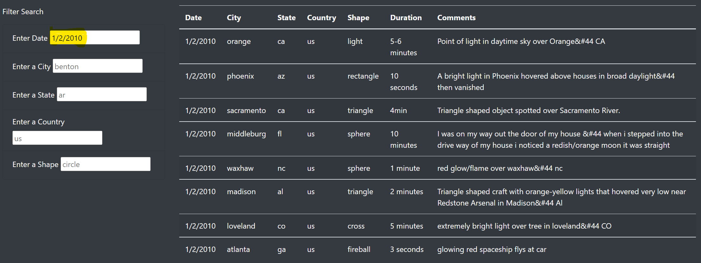
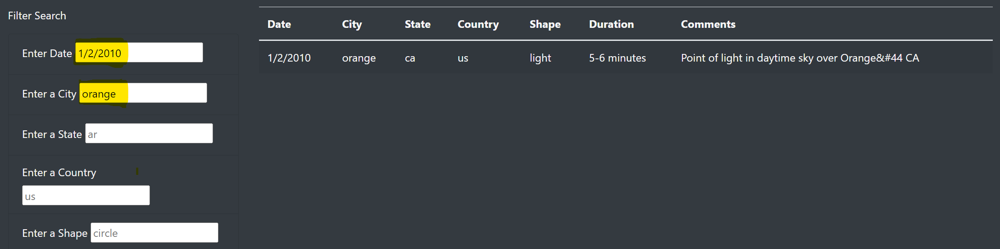
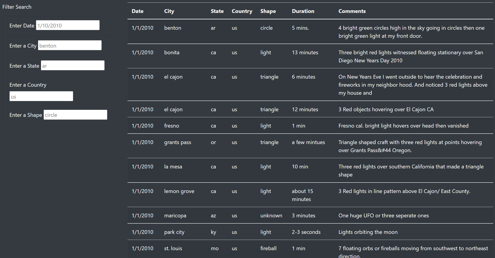

# UFOs

https://hamzaali00.github.io/UFOs/

## Purpose
The purpose of this analysis was to create a webpage using HTML, and utilize javascript to create functions to allow filtering capabilities.

## Results
After loading the website, you will see all of the data from the data.js file neatly sorted on the right hand side. On the left hand side you will see the "Filter Search", where you can filter the table to the data you want to see.

You can filter the data by: date, city, state, country, shape. 

Enter the filter you would like to apply, and click enter to filter the table.

Multiple filters can be applied at once.

To return the table back to the original, click the "UFO Sightings" in the top left corner of the page to reset.

## Summary
A drawback to this new design is that the user does not know the data that is displayed, and without knowing the content of all the data they won't know what to filter for.

This could be fixed by creating a drop-down menu when  going to type in the filter, that has all the possible filters.

Another update that could be made is a "Clear Filters" button, more obvious than the "UFO Sightings" at the top of the page.

